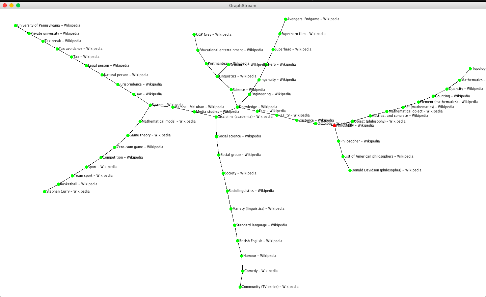
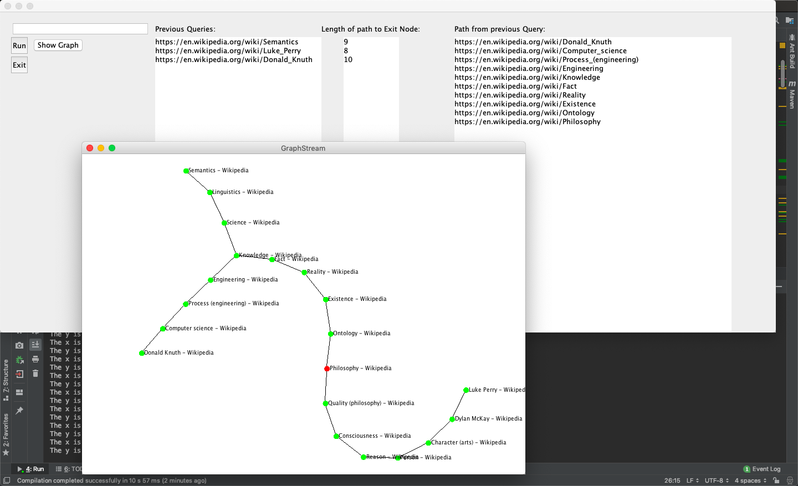

# wikipedia-follow-first-link-to-Philosophy
This program takes input nodes, and traverses the first link on each page until we reach Philosophy. A path is created every time you input a wikipedia link. This program finally outputs and displays a graph. Multiple source pages can be added, and the graph shows the path from all of those pages.

You can then enter in any number of wikipedia links and program crawls over first link in the page repeatedly until we reach Philosophy. The path is then displayed along with its size. 
 

After you have done this process a few times for a few different pages, you can click on "get funnels" which shows you all the nodes which "act" as funnels in the graph formed by the paths of the pages you input.

You can also click on "Show Graph" which will show a visualization of the graph created from the various paths

# Sample Paths

# Installation:

Before you can run this file you need to ensure that you have installed the following libraries. We use these to visually display the graphs we create:

	- gs-core-1.3.jar
	- gs-core-1.3-sources.jar

You can head to this link (http://graphstream-project.org/doc/Tutorials/GraphStream-Maven/) to find the installation instructions for the Graph Stream Library

To run the program run h5_ui.java. This class is the main Driver of the entire program. It contains the UI elements, and pulls elements from all over On startup you'll be asked to enter the "final" node. We have done our analysis with the final node being https://en.wikipedia.org/wiki/Philosophy.

Enter this link and click on continue.

You can then enter in any number of wikipedia links and program crawls over first link in the page repeatedly until we reach Philosophy. The path is then displayed along with its size. 
 

After you have done this process a few times for a few different pages, you can click on "get funnels" which shows you all the nodes which "act" as funnels in the graph formed by the paths of the pages you input.

You can also click on "Show Graph" which will show a visualization of the graph created from the various paths

***************************************************************************************************************************

# Brief Description of the Structure

Node.java: 
This class stores wikipedia links, parses out their page names, and overall acts as a backnone. It's main function is to represent the nodes in out graph

Graph.java: 
As the name suggests this class which stores, creates and represents the Graph. A graph is saved in the form of an adjacency List. The adjacency list is stores as a hashmap, where the key is a node, and the value is an arraylist of all the nodes which are its neighbours. We have implemented BFS as a method in this class so we can get the distance from any node to the Philosophy wikipedia page. 

Scraper.java: 
This is the main scraper class. This class contains the meat of the scraper and contains the most important methods. It also contains the link validators, and also a method which writes the graph to an external text file. You can also get the length of any input node's path's size via the internal methods in this class

GraphVisaulizer.java: 
This is the class which directly interacts with the external Graph Stream library which we are using to visualize the graphs we are creating. This class converts our graph representation to Graph Stream's representation. Funnels are colored blue, normal nodes are colored green and Philosphy is colored red in this class

AnalysisDriver.java
Class which corresponds to "Generate Random Graph" in the UI. This class uses Wikipedia's random page generators, and gets 50 random pages. On every page, we start traversing the page and clicking on the first link. We keep on repeating this process until we get to parenthesis. This class also contains a method which writes all the data collected to csv with the name csv_graph.csv

***************************************************************************************************************************
